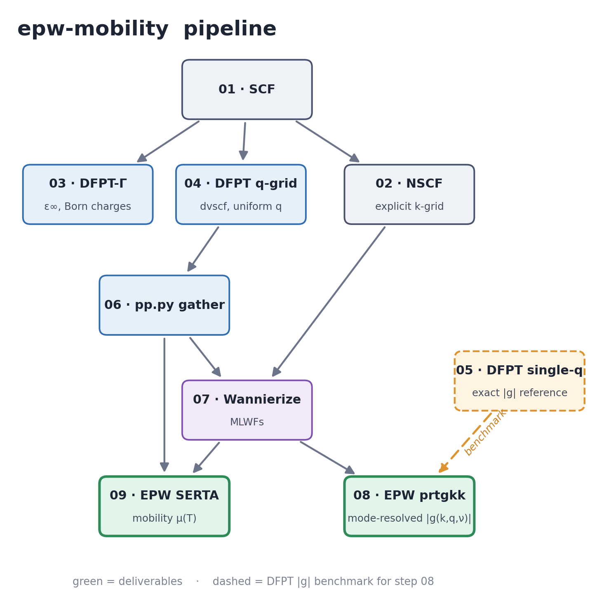

# epw-mobility

An [Agent Skill](https://docs.claude.com/en/docs/agents-and-tools/agent-skills)
for computing **phonon-limited carrier mobility** and **mode-resolved
electron-phonon coupling** in 2D materials with **Quantum ESPRESSO + EPW**.

It turns an LLM coding agent into a careful operator of the full
SCF → NSCF → DFPT → Wannier → EPW pipeline. The skill is the
[`epw-mobility/`](epw-mobility/) directory; [`SKILL.md`](epw-mobility/SKILL.md)
is the entry point.

## What it can do

- Guards to let the agent do the Wannier interpolation correctly.
- Produces carrier mobility end-to-end, plus the mode-resolved EPC |g|.
- Human-curated troubleshooting covering the common mistakes an agent might make.
- Extracts the |g| reference directly from DFPT (`ph.x`).

## Requirements

- Quantum ESPRESSO 7.4.1 with EPW and Wannier90 (the pipeline relies on
  `assume_isolated='2D'` in `pw.x` **and** `ph.x`, plus EPW's 2D long-range
  kernel).
- ONCV SG15 PBE pseudopotentials (or your own, re-validated).
- Python 3.9+ for `parsers/*.py` and EPW's `pp.py`.
- An MPI build (the step files assume `mpirun`).

## License

[MIT](LICENSE).
