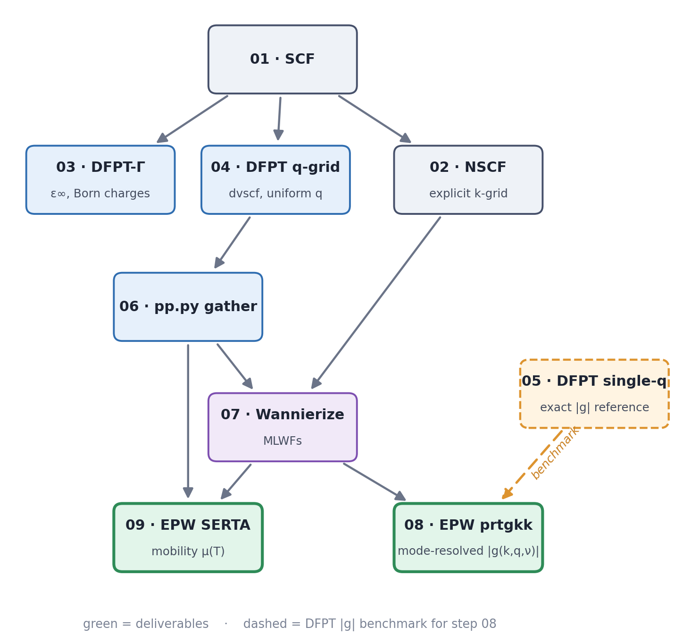

# epw-mobility

An [Agent Skill](https://docs.claude.com/en/docs/agents-and-tools/agent-skills)
for computing **phonon-limited carrier mobility** and **mode-resolved
electron-phonon coupling** in 2D materials with **Quantum ESPRESSO + EPW**.

It turns an LLM coding agent into a careful operator of the full
SCF → NSCF → DFPT → Wannier → EPW pipeline. The skill is the
[`epw-mobility/`](epw-mobility/) directory; [`SKILL.md`](epw-mobility/SKILL.md)
is the entry point.

The step files are worked end-to-end on a 2D ZrS₂ monolayer as the benchmark
and troubleshooting reference — point your agent at your own material and have
it adapt this example rather than copy it.

## Workflow

## What it can do

- Guards that let the agent iteratively tune the Wannier interpolation.
- Special 2D-material notes for the PW and EPW settings.
- Produces carrier mobility end-to-end, plus the mode-resolved EPC |g|.
- Includes human-curated troubleshooting covering the common mistakes an agent might make.
- Extracts the |g| reference directly from DFPT (`ph.x`).

## Requirements

- Quantum ESPRESSO 7.4.1 with EPW and Wannier90.
- Python 3.9+ for `parsers/*.py` and EPW's `pp.py`.
- An MPI build (the step files assume `mpirun`).

## License

[MIT](LICENSE).
